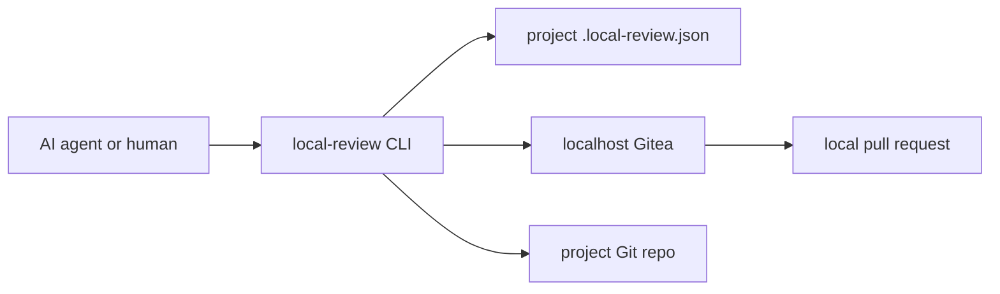

# Architecture

`local-review` separates durable project facts from hard runtime behavior.

## Layers

| Layer | Owns | Does not own |
| --- | --- | --- |
| CLI | deterministic local-review actions | project release policy |
| Skill | when agents should call the CLI | implementation details |
| Project config | repo names, paths, base branches | Docker/Gitea internals |
| Runtime state | Gitea data, generated credentials | source-controlled rules |

## Design Rule

The CLI is the hard safety boundary. Prompts and project docs describe intent,
but the CLI enforces local-only behavior.
